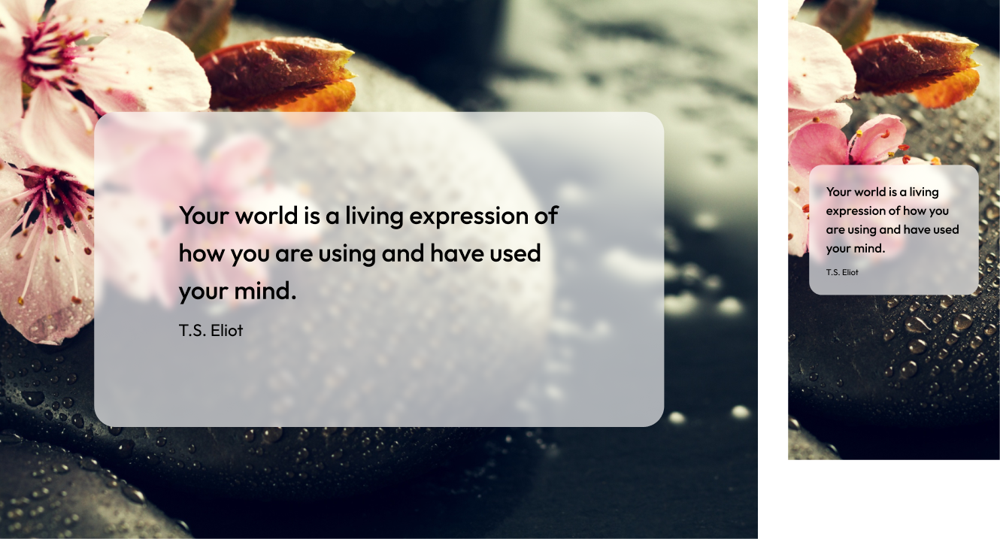

# 001 - Design (Angular)

## Estrutura

Os arquivos devem ser disponibilizados em `src/app/quote` sendo:

- Subpasta `feature` para smart components;
- Subpasta `ui` para dumb components;
- Subpasta `data` para service + model;
- Subpasta `util` para diretivas, pipes e outros, se necessário.

## Componentes

- Devem ser standalone. Não é necessário configurar explicitamente pois é padrão do Angular 21.
- Usar estratégia OnPush nos dumbs e signals para otimizar performance.
- Usar injeção de dependência via inject() nos smarts.

### QuoteCardComponent (dumb)

Inputs (Signal):

- quoteText: string
- author: string
- loading: boolean
- errorMessage: string

Outputs (Signal):

- refresh: void

Premissas:

- Renderizar UI com base nos inputs;
- Emitir refresh quando usuário clicar;
- Ser responsivo;
- Usar fonte Outfit já configurada em `index.html`;
- Basear-se nos protótipos a seguir;
- A imagem para o fundo está em `./public/background.jpg`.

### QuoteContainerComponent (smart)

Premissas:

- Chamar QuoteService;
- Controlar loading/erro/dados;
- Passar dados pro QuoteCard.

Rota

- Componente deve ser carregado via lazy loading através da rota `home`;
- Deve haver uma rota default vazia direcionando para a `home`.

## Service

### QuoteService

- getRandomQuote(): Observable<Quote>
- Faz HTTP GET e mapeia DTO da API para o modelo interno.

## API/contrato

- A ZenQuotes responde com JSON array e campos como:
  q = quote text, a = author, h = html formatado, etc.

## Testes

- Devem ser implementados com Vitest (já configurado na aplicação).

## Atribuição

- Exibir "Inspirational quotes provided by ZenQuotes API" com link, conforme exigência.
